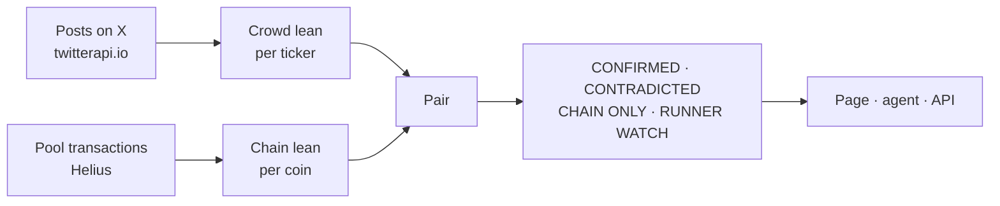

<p align="center">
  
</p>

<p align="center">
  <strong>An autonomous AI agent that reads what retail says against what it trades on Solana.</strong>
</p>

<p align="center">
  Retail says one thing on X. Its wallets do another on chain.<br>
  MEDUSA reads the two against each other, coin by coin, and says where they disagree.
</p>

<p align="center">
  
  
  
  
  
</p>

<p align="center">
  <a href="https://medusa.cash"><strong>medusa.cash</strong></a> ·
  <a href="https://medusa.cash/agent">the agent</a> ·
  <a href="https://game.medusa.cash">the game</a> ·
  <a href="https://x.com/0x_fokki">@0x_fokki</a>
</p>

---

## The agent

Every day the crowd tells you what it thinks: bullish, bearish, "sending it", "getting out". Every hour the chain tells you what it did. The two rarely match, and the gap between them is the most honest signal retail produces.

MEDUSA is an always-on agent that reads both sides and keeps score. It pulls the loudest calls about Solana's trending memecoins from X, reads the last hour of trades straight off Solana, and pairs them coin by coin. Where words and money agree, she says **CONFIRMED**. Where they point opposite ways, **CONTRADICTED**. Where real buyers pile in while nobody is talking, she raises **RUNNER WATCH**.

> **Words on one side. Money on the other. The verdict is the difference.**

She never trades, never signs a transaction, never holds a wallet. Every trade on the page links to its transaction on Solscan. Every post is quoted as written and links to the original.

## Three ways in

| | What it is |
|---|---|
| **[medusa.cash](https://medusa.cash)** | The board: her read of one coin, the loudest calls on X, the largest buys of the hour, and the verdict for the trending ten. |
| **[medusa.cash/agent](https://medusa.cash/agent)** | Read any coin yourself. Sign a message with Phantom, Solflare or Backpack (no transaction, no gas), paste a ticker or a mint, get one score. One free read per wallet per day; holders of $MEDUSA will get more once the token exists. |
| **[game.medusa.cash](https://game.medusa.cash)** | Six jellyfish, six Solana memecoins. Call UP or DOWN before the hour is out, earn points, see which sea creature your wallet is. Points only, no money moves. |

## Why this is an AI agent

Not a dashboard, not a sentiment widget. The software runs its own loop, unattended:

1. **Pick** — take the ten coins trending on Solana right now, from DexScreener and pump.fun's own feeds, one row per ticker, never a stablecoin or a wrapped major.
2. **Watch** — walk the last hour of every coin's pool through Helius, net what each wallet ended up with per transaction, drop programs and round trips.
3. **Listen** — read the day's posts about those ten on X, keep the ones with a clear direction, tag each bullish or bearish and by emotion (greed, fear, FOMO, hopium, cope).
4. **Pair** — put the crowd's lean next to the chain's lean for every coin with enough of both.
5. **Judge** — score the pair, name the verdict, flag the runners.
6. **Publish** — rewrite the page on every chain read, and answer any wallet that asks about any coin.

The intelligence is a transparent pairing rule, not an LLM. Every number on the page can be recomputed from the scripts in this repository.

## What she reads



**One watchlist, everywhere.** `pull-chain.mjs` ranks every candidate by how hard it is trading this hour against its average hour, and keeps the top ten. Those ten are what the X read searches, what the chain reader always carries (a quiet hour is a row that says so, not a missing one), and what every board on the page shows.

**The chain side is read, not fetched.** For each coin, `read-chain.mjs` asks Helius for the pool's recent signatures, drops failed transactions (on Solana there are often more of those than real ones, bots racing), parses the rest and takes each account's **net token-balance change** in that transaction. That works the same on every DEX: a pump.fun bonding curve, PumpSwap, Raydium, Orca, Meteora, a Jupiter route through several hops. Accounts owned by a program rather than the System Program are dropped, so vaults and routers never count as buyers. DexScreener supplies names and prices only.

**The social side is MEDUSA's own reading.** Nobody tags their post Bullish or Bearish on X, so every direction is read from the words. A post whose direction cannot be read is kept for the record and never put on the board. Copy-pasted vote drives, shill templates and bot accounts are dropped before anything is counted.

## How she scores

```
chain lean  = (buyers − sellers) / wallets        last hour, at least 3 wallets
crowd lean  = (bull − bear) / tagged posts         today, at least 2 posts
score       = (chain lean + crowd lean) / 2 × 100  or the chain lean alone when the crowd is silent

CONFIRMED      both leans point the same way
CONTRADICTED   they point opposite ways
CHAIN ONLY     fewer than 2 posts read
TOO THIN       a watchlist coin with fewer than 3 wallets this hour
RUNNER WATCH   chain lean ≥ 0.5 across ≥ 5 wallets, the crowd not against it, the coin at least a day old
```

The agent's read adds a grade on top of the score: **STRONG**, **DECENT**, **NOISE**, **WEAK** or **BAD**, with the caveats that make a +40 on nine wallets worth less than it looks (thin sample, money and words disagree, under a day old).

RUNNER WATCH is not a price call. It marks where money is concentrating right now while the crowd is quiet, and nothing more.

## What the board looked like

Snapshot from **2026-09-27, 07:05 UTC**. The live figures are on the site; this is a record of one moment.

**On chain, the last hour**

| Metric | Result |
|---|---:|
| Slot the read ended at | 450,924,319 |
| Coins walked | 23 |
| Coins traded by real wallets | 20 |
| Distinct wallets | 1,594 |
| Buys / sells | 2,229 / 1,592 |
| Money through the pools | $309.5K |
| Biggest single trade | $8.3K · PUMP · sell |
| Helius calls for the whole pass | 63 |
| Transactions parsed | 3,282 |

**On X, the day**

| Metric | Result |
|---|---:|
| Posts read | 234 |
| Posts with a clear position | 34 |
| Trending coins with a top post found | 9 of 10 |
| The loudest six, combined reach | 257K followers |

**Verdicts**

| Metric | Result |
|---|---:|
| On the board | 20 |
| CONFIRMED / CONTRADICTED / CHAIN ONLY | 4 / 3 / 13 |
| Runner watch | 1 |
| Strongest score | SWARM, +87 |

Most rows are **CHAIN ONLY** on a typical day: the coins that move hardest on Solana are often hours old, and nobody has posted about them by cashtag yet. That gap is itself the finding, and the page says so rather than filling it in.

## Run it yourself

Requirements: **Node.js 20+**, a [Helius](https://helius.dev) key, and (for the X side) a [twitterapi.io](https://twitterapi.io) key.

```bash
git clone https://github.com/0xfokki/medusa-sol.git
cd medusa-sol
npm install

echo "your-helius-key" > .helius-key      # or HELIUS_KEY=...
echo "your-twitterapi-key" > .x-key       # or TWITTERAPI_KEY=...  (optional)

NO_BROWSER=1 node scripts/pull-chain.mjs  # the trending ten and the universe → chain-data.js
node scripts/read-chain.mjs 60            # the last hour, read off Solana → chain-live.js
node scripts/pull-daily.mjs               # today's X read → daily-data.js
node scripts/sample-read.mjs <mint>       # one full read for the front page → agent-sample.js

npx serve .                               # the page is one file; any static server will do
```

Both key files are gitignored. Everything degrades without the X key: the verdicts become CHAIN ONLY and the daily read stays empty.

**The agent** is its own small service:

```bash
PORT=4667 DATA_DIR=./.agent CHAIN_FILE=$PWD/chain-data.js node server/agent-server.mjs
```

It serves `/api/agent/*` (nonce, verify, me, reads). Put it behind a reverse proxy on the same host as the page. The daily quota lives in `DATA_DIR/quota.json`; the $MEDUSA holder line, once the mint exists, goes in `DATA_DIR/agent-token.json`.

**The game** lives in [`game/`](game/) and deploys to Vercel on every push that touches it. See [`game/README.md`](game/README.md).

### What it costs to run

Helius meters every call. Parsed transactions are cached for a day in `.sol-cache.json`, so each pass pays only for what is new, and `SOL_SIG_CAP` (default 300) bounds what one hot coin may cost per pass: past it the row covers "the last N minutes" and says so. The X side is one request per trending coin plus one over a few curated accounts, a few cents a run.

## Architecture

| Path | Responsibility |
|---|---|
| [`index.html`](index.html) | The whole board: her read, the loudest calls, the largest buys, the verdict |
| [`agent.html`](agent.html) | The agent's seat: wallet sign-in and reads on demand |
| [`jelly-hero.js`](jelly-hero.js) | The particle jellyfish on the agent page |
| [`scripts/chains.mjs`](scripts/chains.mjs) | Chain config: Helius, DexScreener, Solscan, quote tokens, limits |
| [`scripts/solana.mjs`](scripts/solana.mjs) | Helius helpers: signatures, parsed transactions, wallet-vs-program, SPL balances, SOL price |
| [`scripts/pull-chain.mjs`](scripts/pull-chain.mjs) | The trending ten and the universe, from DexScreener and pump.fun |
| [`scripts/read-chain.mjs`](scripts/read-chain.mjs) | The last hour of every coin, read off Solana |
| [`scripts/pull-daily.mjs`](scripts/pull-daily.mjs) | The X read; `pull-x.mjs` and `pull-news.mjs` are its parts |
| [`scripts/sample-read.mjs`](scripts/sample-read.mjs) | One full agent read for the front page |
| [`server/agent-server.mjs`](server/agent-server.mjs) | The agent service; `agent.mjs` routes, `read.mjs` reads, `holding.mjs` the holder line |
| [`server/thoughts.mjs`](server/thoughts.mjs) | The intake behind "Feed MEDUSA" |
| `chain-data.js` · `chain-live.js` · `daily-data.js` · `agent-sample.js` | The data the page reads, written by the scripts above |
| [`game/`](game/) | The prediction game: Vercel functions, Supabase schema, the wallet card |

## Trust model

- Nothing on the board is invented. The ambient life of the jellyfish is the only simulated thing, and the code says so.
- Every trade links to its transaction and its wallet on Solscan.
- Every post is quoted as written and links to the original; MEDUSA's own readings are marked as hers.
- The verdict rule is five lines and lives on the page, where anyone can read it.
- Signing in to the agent is a message signature, never a transaction. No custody, no approvals. She reads.

## Limitations

- The social side covers what people post by cashtag. Coins that move on chain without a crowd around them show as CHAIN ONLY, which is a true statement, not a gap in the data.
- One hour on chain against one day on X is a deliberate pairing of two different windows.
- A very hot coin is read over its last few hundred trades rather than the full hour; the row says how many minutes that was.
- Wallet counts are distinct addresses. One person with five wallets counts five times; a bot that nets to zero counts zero.
- Solana addresses are base58, up to 44 characters and case-sensitive. Anything that lowercases a wallet or a mint breaks silently.
- A verdict is a description of the last hour and today, not a forecast.

## Built on

| Source | Used for |
|---|---|
| [Helius](https://helius.dev) | RPC and parsed transactions |
| [DexScreener](https://dexscreener.com) | Names, prices, liquidity, trending candidates |
| [pump.fun](https://pump.fun) | Live launches as candidates |
| X via [twitterapi.io](https://twitterapi.io) | The crowd's words |
| [GMGN](https://gmgn.ai) | Wallet history for the game's card |
| [Supabase](https://supabase.com) · [Vercel](https://vercel.com) | The game's database and hosting |

MEDUSA is independent of Solana, pump.fun, Helius, DexScreener, GMGN and X and is not endorsed by them.

## License

MIT.
